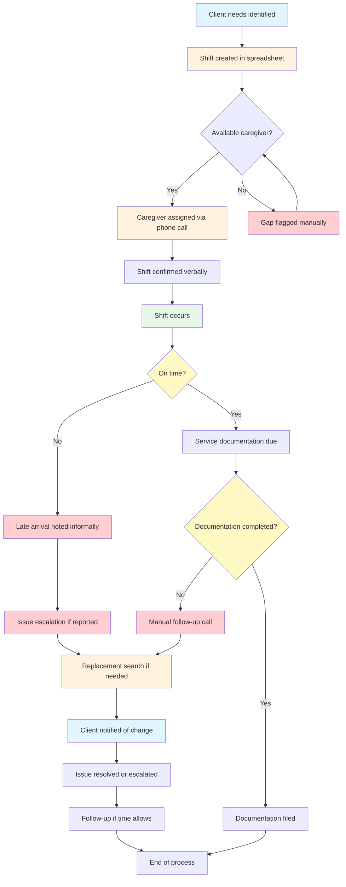

# Current-State Process Analysis

**Company:** BrightCare Home Services (Fictional)  
**Document:** 07-current-state-process.md  
**Date:** July 21, 2026  
**Author:** Titus Banks — Business Analyst  

---

## Process Overview

The current operational workflow at BrightCare Home Services spans shift creation through follow-up and reporting. The process is characterized by manual steps, fragmented communication channels, and limited visibility at every stage.

---

## Mermaid Process Diagram

---

## Step-by-Step Process

### Step 1: Shift Creation

| Element | Description |
|---------|-------------|
| Actor | Scheduling Coordinator |
| Input | Client care plan, service schedule, caregiver availability |
| Action | Create shift record in spreadsheet or written schedule |
| Output | New shift entry |
| System/Channel | Spreadsheet, paper calendar, or email |
| Delay | No real-time creation; often batched weekly |
| Failure Point | No validation that shift information is complete |
| Manual Work | Entirely manual entry |
| Data Gap | No structured format — inconsistent data entry |
| Control Weakness | No approval or verification step |

### Step 2: Caregiver Assignment

| Element | Description |
|---------|-------------|
| Actor | Scheduling Coordinator |
| Input | Shift details, caregiver availability |
| Action | Call or text potential caregivers to fill shift |
| Output | Verbal or text-based agreement |
| System/Channel | Phone, text message |
| Delay | Dependent on caregiver response time |
| Failure Point | No confirmation system; verbal agreements can be forgotten |
| Manual Work | Phone tag, multiple calls per shift |
| Data Gap | No centralized record of assignment status |
| Control Weakness | No documented acceptance process |

### Step 3: Shift Confirmation

| Element | Description |
|---------|-------------|
| Actor | Scheduling Coordinator / Caregiver |
| Input | Assigned shift details |
| Action | Caregiver verbally confirms or does not respond |
| Output | Confirmed (or assumed) shift coverage |
| System/Channel | Phone call, text message |
| Delay | Confirmation often received after deadline |
| Failure Point | Assumed confirmation if no response received |
| Manual Work | Manual confirmation tracking |
| Data Gap | No confirmation timestamp or record |
| Control Weakness | No systematic confirmation before shift start |

### Step 4: Late-Arrival Detection

| Element | Description |
|---------|-------------|
| Actor | Caregiver / Care Coordinator |
| Input | Shift start time, actual arrival time |
| Action | Caregiver may call if running late; coordinator may notice absence |
| Output | Informal late notification |
| System/Channel | Phone call, text message |
| Delay | Late notification often received after shift should have started |
| Failure Point | No automated detection or threshold tracking |
| Manual Work | Waiting and wondering |
| Data Gap | No arrival time data collected |
| Control Weakness | No standard definition of "late" |

### Step 5: Missed-Shift Discovery

| Element | Description |
|---------|-------------|
| Actor | Client, Care Coordinator, or Caregiver |
| Input | Missing caregiver at client location |
| Action | Client calls office; coordinator discovers absence |
| Output | Emergency gap notification |
| System/Channel | Phone call from client or caregiver |
| Delay | Discovered reactively after shift start time |
| Failure Point | No pre-shift confirmation check |
| Manual Work | Emergency scrambling to find replacement |
| Data Gap | No record of missed shift frequency or patterns |
| Control Weakness | No preventive screening before shift |

### Step 6: Escalation

| Element | Description |
|---------|-------------|
| Actor | Care Coordinator / Operations Manager |
| Input | Issue notification (missed shift, late arrival, complaint) |
| Action | Pass issue to next person via phone or email |
| Output | Issue handed off |
| System/Channel | Phone, email, text |
| Delay | Dependent on recipient availability and response time |
| Failure Point | No documented escalation path or severity levels |
| Manual Work | Multiple handoffs before reaching decision-maker |
| Data Gap | No escalation history or timeline |
| Control Weakness | No audit trail of escalation decisions |

### Step 7: Replacement Search

| Element | Description |
|---------|-------------|
| Actor | Scheduling Coordinator |
| Input | Open shift that needs coverage |
| Action | Call alternative caregivers to fill gap |
| Output | Replacement caregiver or unfilled gap |
| System/Channel | Phone, text |
| Delay | Significant — each call takes time, no guarantee of success |
| Failure Point | No backup caregiver list or pre-qualified replacements |
| Manual Work | Entirely manual search process |
| Data Gap | No record of replacement success rate or time-to-fill |
| Control Weakness | No defined process for when replacement cannot be found |

### Step 8: Client Communication

| Element | Description |
|---------|-------------|
| Actor | Client Services Representative / Care Coordinator |
| Input | Change in schedule or caregiver |
| Action | Call client to inform of change |
| Output | Verbal or message notification |
| System/Channel | Phone call, voicemail |
| Delay | Communication may happen after caregiver was due |
| Failure Point | Client may not receive notification before shift |
| Manual Work | Manual dialing, leaving messages, call-backs |
| Data Gap | No record of whether client was notified |
| Control Weakness | No confirmation that client received the message |

### Step 9: Service Documentation

| Element | Description |
|---------|-------------|
| Actor | Caregiver |
| Input | Shift details, services provided |
| Action | Complete paper or digital documentation after shift |
| Output | Documentation record |
| System/Channel | Paper form, basic digital form |
| Delay | Completion varies from immediately to days later |
| Failure Point | No tracking of documentation status or completion rate |
| Manual Work | Paper forms need manual data entry |
| Data Gap | No visibility into documentation completion |
| Control Weakness | No enforcement of documentation deadlines |

### Step 10: Follow-Up

| Element | Description |
|---------|-------------|
| Actor | Care Coordinator / Operations Manager |
| Input | Issue that was resolved or escalated |
| Action | Check back on issue if time permits |
| Output | Verbal status update |
| System/Channel | Phone, email |
| Delay | Follow-up is ad-hoc, if done at all |
| Failure Point | No scheduled follow-up or ownership assignment |
| Manual Work | Remembering to follow up with no system prompts |
| Data Gap | No follow-up status or completion tracking |
| Control Weakness | No verification that issues are closed |

### Step 11: Management Reporting

| Element | Description |
|---------|-------------|
| Actor | Operations Manager |
| Input | Scattered data from spreadsheets, emails, phone notes |
| Action | Manually compile operational summary |
| Output | Verbal or written status update |
| System/Channel | Email, meeting |
| Delay | Report may be weeks out of date |
| Failure Point | Manual compilation is time-consuming and error-prone |
| Manual Work | Data gathering, reconciliation, formatting |
| Data Gap | No real-time metrics; no historical trends |
| Control Weakness | No standardized report format or metrics |

---

## Process Metrics Summary

| Metric | Current State |
|--------|--------------|
| Shift confirmation time | Unknown — not tracked |
| Gap identification time | Reactive — discovered after shift start |
| Average escalation time | Unknown — not tracked |
| Documentation completion rate | Unknown — not tracked |
| Follow-up completion rate | Unknown — not tracked |
| Late arrival rate | Unknown — not tracked |
| Missed shift rate | Unknown — not tracked |
| Client notification delay | Unknown — not tracked |
| Management report frequency | Ad-hoc, when requested |
| Data accuracy | Low — manual entry, inconsistent sources |

---

## Communication Channels Map

| Interaction | Channel Used | Reliability |
|-------------|-------------|-------------|
| Shift assignment | Phone / text | Low — no written confirmation |
| Shift confirmation | Verbal | Low — can be forgotten |
| Late notification | Phone | Low — dependent on caregiver initiative |
| Gap notification | Phone | Low — dependent on discovery |
| Escalation | Phone / email | Medium — dependent on recipient |
| Client communication | Phone | Low — voicemail may be missed |
| Schedule changes | Phone / text | Low — fragmented |
| Issue follow-up | Phone / email | Low — no system |
| Reporting | Email / meeting | Low — manual compilation |

---

## Key Observations

1. **No single source of truth** — Information is spread across spreadsheets, paper notes, emails, and phone calls
2. **Reactive rather than proactive** — Issues are discovered after they impact clients
3. **Manual processes dominate** — Every step requires human intervention and judgment
4. **No standard definitions** — "Late," "urgent," and "resolved" mean different things to different people
5. **No data collection** — Operational metrics are not captured, making pattern identification impossible
6. **Fragmented communication** — Information passes through multiple people and channels
7. **Inconsistent follow-through** — Follow-up depends on individual memory and initiative

---

## Related Documents

- 02-business-problem.md — Problem statement
- 08-pain-point-analysis.md — Root cause and gap analysis
- 09-business-requirements-document.md — BRD with current-state summary
